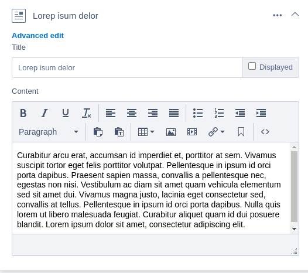

# SilverStripe Elemental Advanced Edit

A simple extension that adds the a CMS Edit link to an element that is inline-editable.

Released as work-around to use inline editting on a element that has "complex fields" 
that are not avalable in inline editing (such as DisplayLogic/GridFields/etc.).

More info about the idea of an "advanced editing" menu for elemental; https://github.com/silverstripe/silverstripe-elemental/issues/757

#### Screenshot

### TO-DO
* Add an variable (`private static $hide_inline = [];`) to hide specific fields on inline edit
  * This to hide "complex fields" and made them only available in the advanced editing

## Requirements
* SilverStripe ^4.8
* dnadesign/silverstripe-elemental ^4.7

## Installation
* `composer require robertvanlienden/silverstripe-elemental-advanced-edit`

## Configuration
By default, advanced editing is turned on. 
You can add the following variable to a element to turn advanced editing off.
`private static $advanced_editing = false;`

The advanced edit link will only get rendered when inline editing.

## License
See [License](LICENSE)

## Maintainers
* [Robert van Lienden](https://www.robertvanlienden.nl/) <mail@robertvanlienden.nl>

## Development and contribution
Pull requests are welcome. For major changes, please open an issue first to discuss what you would like to change.

## Donations
If you want to buy me a coffee to thank me for sharing this piece of software, it's possible to donate Paypal.me/robertvanlienden.
